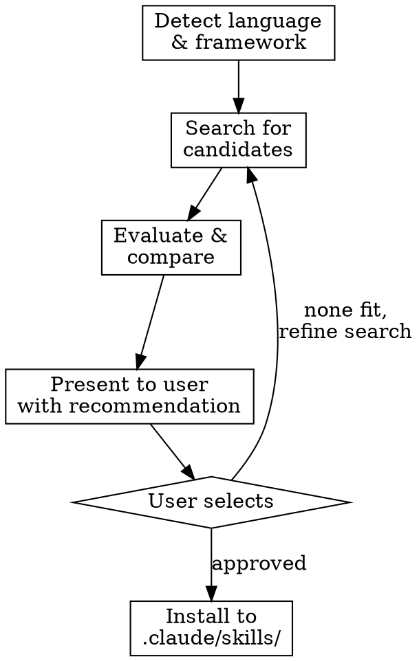

# Find Best Practices

**This skill requires maximum reasoning effort.** Think deeply at every step — evaluate quality critically, compare candidates thoroughly, and provide well-reasoned recommendations. Do not rush the evaluation.

ultrathink Search the web for top-rated Claude Code skills for a specific language or framework. Find community-vetted best-practice guides, compare candidates, and install the best one.

## Process



### Step 1 — Determine Search Target

**If an argument was provided** (e.g., `/find-best-practices spring-webflux`):
- Use the argument as the search target directly
- Run **one search round** for that specific technology (3 candidates)
- Skip to Step 2

**If no argument was provided** (just `/find-best-practices`):
- Read `.llm/memory/INDEX.md` and find the tech stack document. Extract:
  - **Primary language** (e.g., Java, TypeScript, Python, Go, Rust) + version
  - **Main framework** (e.g., Spring Boot, Next.js, Django, Express) — pick the dominant one, ignore small libraries
- If no tech stack document exists, inspect the project root for manifest files (pom.xml, package.json, go.mod, Cargo.toml, etc.)
- Run **two separate search rounds** — one for the language, one for the main framework

### Step 2 — Search for Candidates

For each search target, find **4 candidates**:

**Source A — GitHub skill repos (find 2):**

Search GitHub for repos containing Claude Code skills (`.claude/skills/`, `SKILL.md`, or `CLAUDE.md` with coding conventions) for the detected language/framework.

Search queries to try (adapt to the language/framework detected):
```
"claude code" skill "<language>" best practices github SKILL.md
".claude/skills" "<language>" github.com
"claude code" "<framework>" SKILL.md conventions
CLAUDE.md "<language>" coding standards site:github.com
```

For each candidate found:
1. Use `WebFetch` to read the raw SKILL.md or CLAUDE.md content from the repo
2. Note the repo's star count, last update date, and community engagement
3. Save the full skill content for comparison

**Source B — Blog/article conventions (find 2):**

Search for well-regarded coding convention guides, style guides, or community-endorsed best-practice posts that could be adapted into a skill.

Search queries to try:
```
"<language>" "<framework>" coding conventions 2025 2026 best practices
"<language>" style guide production best practices
"<framework>" project structure conventions patterns
reddit "<language>" best practices claude code
"<language>" coding standards top community guide
```

For each article found:
1. Use `WebFetch` to read the full content
2. Extract the actionable conventions (not opinions or philosophy — concrete rules)
3. Note the source URL, author credibility, and community reception (upvotes, shares, comments)

### Step 3 — Evaluate & Compare

For each set of 3 candidates (language set + framework set), evaluate on:

| Criteria | Weight | What to check |
|----------|--------|---------------|
| **Relevance** | High | Does it match the project's language version and framework? |
| **Quality** | High | Are the rules concrete and actionable, not vague platitudes? |
| **Community** | Medium | GitHub stars, Reddit upvotes, author reputation |
| **Freshness** | Medium | Updated in the last year? Covers current language version? |
| **Compatibility** | Medium | Valid SKILL.md format? Would it conflict with existing project conventions? |
| **Conciseness** | Low | Is it focused (<500 lines) or bloated? |

### Step 4 — Present Comparison

Present to the user in this format — one table per category (language + framework):

```markdown
## Language: <language> — Candidate Comparison

| | Candidate 1 | Candidate 2 | Candidate 3 | Candidate 4 |
|---|---|---|---|---|
| **Source** | [link] | [link] | [link] | [link] |
| **Type** | GitHub skill | GitHub skill | Article | Article |
| **Stars/Engagement** | ... | ... | ... | ... |
| **Last Updated** | ... | ... | ... | ... |
| **Key Strengths** | ... | ... | ... | ... |
| **Weaknesses** | ... | ... | ... | ... |

**My recommendation:** Candidate N because [specific reasons].
[Brief summary of what rules/conventions it covers]

## Framework: <framework> — Candidate Comparison
[Same format]
```

Wait for user to select before proceeding.

### Step 5 — Install

For each selected skill:

**If the source is a GitHub SKILL.md:**
1. Download the raw content via `WebFetch`
2. Write to `.claude/skills/<language>/SKILL.md` or `.claude/skills/<framework>/SKILL.md`
3. Adapt the frontmatter if needed (ensure `name` and `description` fields are present and valid)

**If the source is a blog/article:**
1. Extract the concrete, actionable conventions from the article
2. Format as a proper SKILL.md with frontmatter:
   ```yaml
   ---
   name: <language>-best-practices
   description: Use when writing <language> code — covers naming, patterns, error handling, and project conventions
   ---
   ```
3. Include the source URL as attribution at the bottom
4. Write to `.claude/skills/<language>/SKILL.md`

After installation, report what was installed and where.

## Guidelines

- **Never install without user approval** — always present comparison first
- **Prefer concrete over philosophical** — "use `var` for local variables" beats "write clean code"
- **Check for conflicts** — if the project already has a skill for that language/framework in `.claude/skills/`, warn the user before overwriting
- **Attribution** — always include source URL in installed skills
- **Adapt, don't blindly copy** — if a GitHub skill has project-specific rules that don't apply, strip them out. If an article has good rules mixed with irrelevant ones, extract only what applies.

## Error Handling

- **No tech stack document and no manifest files:** Ask the user what language and framework to search for
- **Search returns no Claude Code skills:** Broaden search to general coding convention guides and offer to convert the best one into a skill
- **Candidate content is behind auth/paywall:** Skip it, note why, move to next candidate
- **Fewer than 3 candidates found:** Present what was found with a note that search coverage was limited
