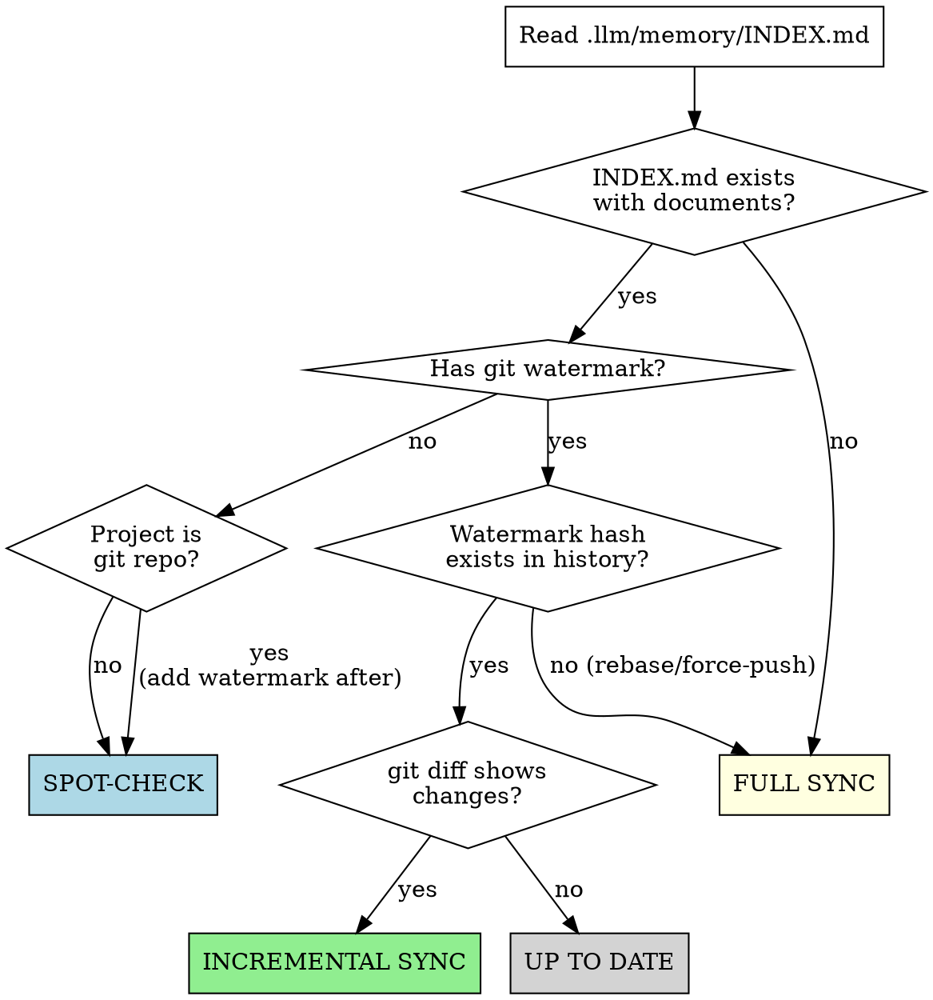

# Sync Memory Bank

Synchronize the `.llm/memory/` knowledge base with the current state of the codebase. Automatically determines whether to run a full build or an incremental update.

## Mode Selection



---

## Full Sync

Build the memory bank from scratch. This is a thorough, comprehensive analysis.

### 1. Check Existing State

- If `.llm/memory/INDEX.md` exists, read it to understand any existing structure or section definitions
- If `memory-searcher-v1` agent is available, search for any existing entries to confirm the bank is truly empty or identify partial coverage
- If `.llm/instructions/runtime/memory-bank.md` exists, read it for document format rules (YAML frontmatter, tags, content rules)

### 2. Deep Codebase Analysis

Examine the project broadly and deeply. For each area, take notes on what you find — these become the raw material for memory bank documents.

**Structure & Stack:**
- List top-level directories, identify the module/package layout
- Find entry points (main class, app bootstrap, server startup)
- Identify the language, version, framework, build tool, and package manager from config files
- Extract key dependencies and their versions from the manifest

**Architecture & Patterns:**
- Identify module boundaries and how they're enforced
- Map cross-module communication patterns (events, direct calls, shared interfaces)
- Identify recurring patterns and abstractions (repository pattern, service layer, DTOs, etc.)
- Analyze configuration files and environment-specific settings
- Document shared infrastructure (auth, error handling, logging, filters)

**Domain & Business Logic:**
- Find entity/model classes — extract fields, types, enums, relationships, key business methods
- Identify status lifecycles and state machines
- Document validation rules, business constraints, domain invariants
- Map data flow from API request through service layer to database

**Endpoints & API (if applicable):**
- Find controllers/handlers — extract routes, HTTP methods, auth requirements
- Identify request/response DTOs
- Document public vs authenticated endpoints
- Find API documentation config (OpenAPI, Swagger, etc.)

**Decisions & Conventions:**
- Look for architectural patterns that reflect deliberate choices
- Document API conventions (error format, headers, versioning)
- Identify auth strategy and permission model
- Understand testing approach and test configuration

### 3. Research (if agents available)

- If `researcher-v1` is available, use it for unfamiliar frameworks or libraries found in the codebase
- If `claude-mem` MCP is available, check for past session context about architecture decisions or prior work

### 4. Create INDEX.md and Write Documents

If `.llm/memory/INDEX.md` doesn't exist, create it. Define sections based on what the codebase actually contains — read `.llm/instructions/runtime/memory-bank.md` for guidance on section types, or create sections that naturally fit the project.

Each INDEX.md section needs:
- A `## Section Name` header
- A description line explaining what belongs there
- Document entries with one-line summaries

For each document:
1. Create the directory if needed (`mkdir -p .llm/memory/<section>/`)
2. Write the document with YAML frontmatter (`title`, `tags`)
3. Keep it concise — 50-100 lines. Prefer multiple focused documents over one large one
4. Include `## Relevant Code` with file paths referencing implementation
5. Include `## Further Reading` with cross-references to other memory bank docs
6. Add the document to INDEX.md with a one-line summary

**Writing priorities (in order):**
1. Architecture overview — modules, communication, stack (orients all future reads)
2. Domain models — entities, fields, enums per module (most frequently queried)
3. Tech stack — language, frameworks, dependencies with versions
4. Decisions — auth, API conventions, testing strategy
5. Endpoints — API reference per module (if applicable)
6. Business rules and product info
7. Complex cross-module flows (techniques)

### 5. Set Watermark

If the project is a git repository, add the watermark to the top of INDEX.md:
```
> **Last synced at:** `<short-hash>` (<date>) — if current HEAD is far from this, the memory bank may need refreshing.
```

---

## Incremental Sync

Update only what changed since the last sync. Run this when the git watermark exists and has diverged from HEAD.

### 1. Identify What Changed

```bash
git diff --name-only <watermark-hash>..HEAD
git log --oneline <watermark-hash>..HEAD
```

Review the diff summary to understand the scope of changes — a single migration file means a small update, a new module means significant new documentation.

### 2. Map Changes to Memory Bank Documents

Read INDEX.md section descriptions to understand what each section covers. For each changed source file, determine which memory bank documents it could affect by matching the change type to the section descriptions in INDEX.md.

A single source file change may affect multiple memory bank documents. A new module or major feature may require entirely new documents.

### 3. Update Affected Documents

For each affected memory bank document:
1. Read the current memory bank document
2. Read the changed source files to understand what's different
3. Edit the document to reflect current state — fix what's wrong, add what's new, remove what's gone
4. If a change requires an entirely new document (e.g., new module, new major feature), create it following the format rules and add to INDEX.md

### 4. Advance Watermark

Update the "Last synced at" line in INDEX.md to the current HEAD hash and date.

---

## Spot-Check

When INDEX.md exists but has no watermark (or the project isn't a git repo), verify documents against current code.

1. Read INDEX.md to get the full document list
2. For each document, spot-check key claims against the current codebase:
   - Do the file paths in `## Relevant Code` still exist?
   - Do entity fields, enum values, and endpoint routes match current code?
   - Are version numbers and dependency lists current?
   - Are cross-references in `## Further Reading` still valid?
3. Fix any stale information found
4. If the project is a git repository, add the watermark to INDEX.md

---

## Document Format

Follow the format defined in `.llm/instructions/runtime/memory-bank.md`. Key rules:

- **YAML frontmatter** with `title` and `tags` (max 10 tags, all start with `#`, use `_` for spaces)
- **Concise content** — enough to answer "what decision was made and why" without reading source
- **`## Relevant Code`** — file paths referencing implementation
- **`## Further Reading`** — cross-references to other memory bank docs
- **Reference, don't duplicate** — link to code, don't copy it. Link to specs, don't restate them
- **Don't duplicate CLAUDE.md** — the memory bank supplements it

## Guidelines

- **INDEX.md is the single source of truth** for memory bank structure — read it to discover sections, update it when adding/removing documents
- **Match existing section structure** — use INDEX.md section descriptions to place documents in the right directory
- **Agents are optional** — if `memory-searcher-v1` or `researcher-v1` are unavailable, use Grep/Glob/Read directly
- **Adapt to the project** — not every project has endpoints, domain entities, or design specs. Create sections and documents that fit what the codebase actually contains
- **Quality over coverage** — a few accurate, well-structured documents are better than many shallow ones

## Error Handling

- **Directory doesn't exist:** Create it with `mkdir -p`
- **Watermark hash not in git history** (force-push, rebase): Fall back to full sync
- **Agent unavailable:** Continue with built-in tools (Grep, Glob, Read)
- **INDEX.md exists but is malformed:** Rebuild it from documents found on disk via `find .llm/memory -name "*.md" -not -name INDEX.md`
- **Provided directory doesn't exist or is inaccessible:** State the issue and suggest alternative paths
